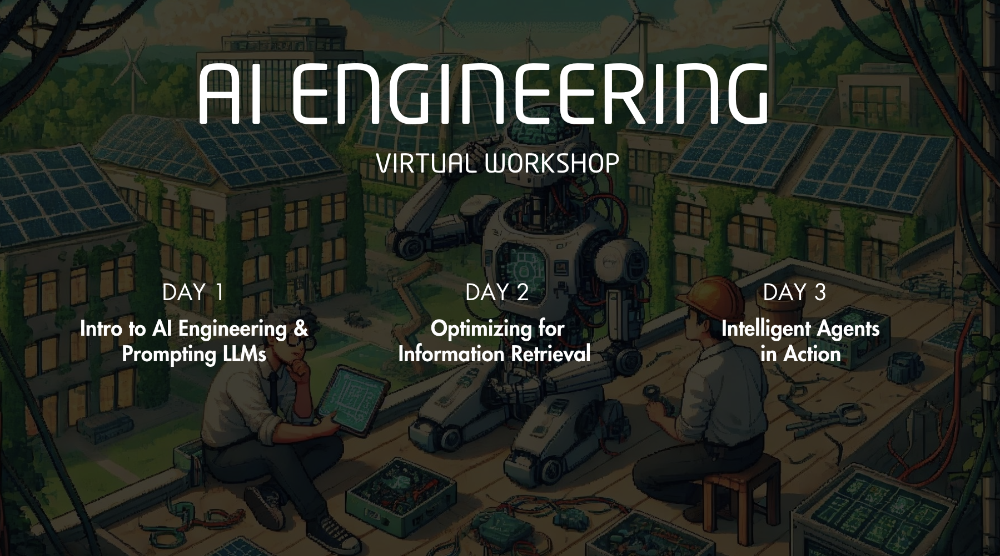

# AI Engineering Workshop Series

This repository contains code and resources shared during the AI Engineering Workshop series organized by Symbiosis Solutions in partnership with Hackademia.

## Introduction

The role of an AI Engineer is becoming increasingly essential as the capabilities of AI continue to expand. This emerging profession blends the principles of software engineering with the application of AI models, moving beyond traditional engineering. The demand for AI Engineers is projected to grow exponentially, fueled by the widespread adoption of AI across various industries. Unlike traditional Machine Learning roles, AI Engineers focus on applying existing models to solve real-world problems, often without the need for a deep research background.

In this workshop series, we delve into various topics of critical importance to AI Engineers. We dive into theories to support the understanding and application of knowledge in designing and developing AI solutions, ranging from simple to complex tools and techniques. The series includes demonstrations of code implementations, engaging activities, and sharing of key industry insights to train, motivate and support participants to pursue a career in AI.

## Workshop Materials

This repository contains a wealth of materials to aid your learning journey. For each day of the workshop, we have provided the corresponding code and presentation slides. These resources will allow you to follow along with the workshop content and explore the topics in more depth at your own pace.

In addition to the materials provided in this repository, we also recommend the following online resources for aspiring AI Engineers:

- [Deep Learning AI](https://www.deeplearning.ai/)
- [AI Engineer on YouTube](https://www.youtube.com/@aiDotEngineer)
- [Groq](https://groq.com/)
- [Llama Index AI](https://www.llamaindex.ai/)
- [Crew AI](https://www.crewai.com/)

These resources offer a variety of learning materials, from in-depth courses to insightful articles, that can further enhance your understanding of AI engineering.

## Contact Us

For any queries or further information, feel free to reach us at [info@symbiosis.solutions](mailto:info@symbiosis.solutions).
